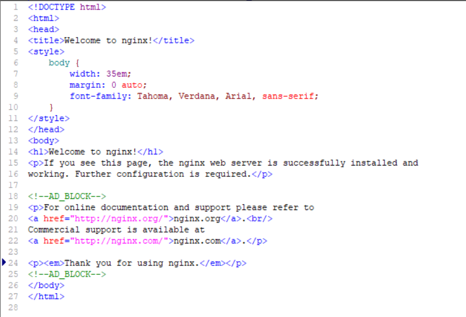
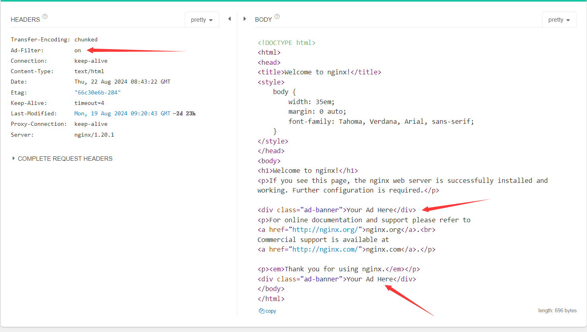

# ngx_http_ad_filter_module

advertisement tag replace in output html

## complile

- ./configure --prefix=/usr/local/nginx/ --add-module=/home/sunder/bin/ngx_filter --with-ld-opt="-lssl -lcrypto"
- make && make install
- start nginx with nginx.conf

## nginx.confg configuration
```
 server {
        listen       80;
        server_name  localhost;

        #charset koi8-r;

        #access_log  logs/host.access.log  main;

        location / {
            #encrypt_switch  off;            #on/off
            #encrypt_type    md5;            #md5/aes
            #encrypt_key     DerekSunder;    #your encrypt_key
            #encrypt_param   value1 value2 value3;   #param want to encrypt

			ad_switch       on;														#on/off
            ad_replace      "<!--AD_BLOCK-->";										#content which want to be replaced
            ad_content      "<div class=\"ad-banner\">Your Ad Here</div>";			#replaced content

            root   html;
            index  index.html index.htm;
        }

        #error_page  404              /404.html;

        # redirect server error pages to the static page /50x.html
        #
        error_page   500 502 503 504  /50x.html;
        location = /50x.html {
            root   html;
        }

        location ~ \.php$ {
            #encrypt_switch  on;             #on/off
            #encrypt_type    aes;            #md5/aes
            #encrypt_key     c4ca4238a0b923820dcc509a6f75849b;     #aes key length should be 32
            #encrypt_param   value1 value2 value3;

			ad_switch       on;														#on/off
            ad_replace      "<!--AD_BLOCK-->";										#content which want to be replaced
            ad_content      "<div class=\"ad-banner\">Your Ad Here</div>";			#replaced content

            root           html;
            fastcgi_pass   127.0.0.1:9000;
            fastcgi_index  index.php;
            fastcgi_param  SCRIPT_FILENAME  /scripts$fastcgi_script_name;
            include        fastcgi_params;
            include        fastcgi.conf;
        }
        ...
}
```
> `ad_switch`: on/off

> `encrypt_type`: md5/aes

> `ad_replace`: the content which you want to be replaced

> `ad_content`: replaced content

> Note: each `location` can config like this.

## module response
the response header will give you a key "Ad-Filter"
> `on`: this filter is opened

> `off`: this filter has been closed

for example:

1.html(raw data)



http://*.*.*.*/1.html(content has been replaced)