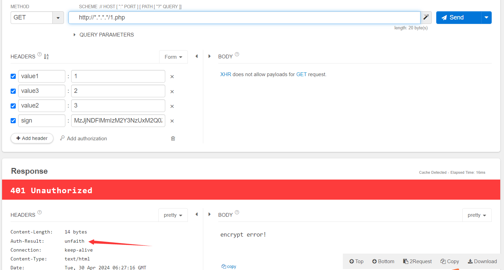
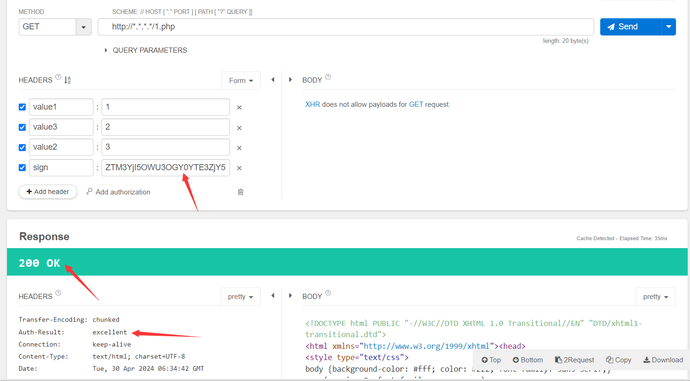

# ngx_http_encrypt_module

encrypt request url parameters authorization, support MD5, AES

## complile

- ./configure --prefix=/usr/local/nginx/ --add-module=/home/sunder/bin/ngx_http_encrypt_module --with-ld-opt="-lssl -lcrypto"
- make && make install
- start nginx with nginx.conf

## nginx.confg configuration
```
 server {
        listen       80;
        server_name  localhost;

        #charset koi8-r;

        #access_log  logs/host.access.log  main;

        location / {
            encrypt_switch  off;            #on/off
            encrypt_type    md5;            #md5/aes
            encrypt_key     DerekSunder;    #your encrypt_key
            encrypt_param   value1 value2 value3;   #param want to encrypt

            root   html;
            index  index.html index.htm;
        }

        #error_page  404              /404.html;

        # redirect server error pages to the static page /50x.html
        #
        error_page   500 502 503 504  /50x.html;
        location = /50x.html {
            root   html;
        }

        location ~ \.php$ {
            encrypt_switch  on;
            encrypt_type    aes;
            encrypt_key     c4ca4238a0b923820dcc509a6f75849b;
            encrypt_param   value1 value2 value3;

            root           html;
            fastcgi_pass   127.0.0.1:9000;
            fastcgi_index  index.php;
            fastcgi_param  SCRIPT_FILENAME  /scripts$fastcgi_script_name;
            include        fastcgi_params;
            include        fastcgi.conf;
        }
        ...
}
```
> `encrypt_switch`: on/off

> `encrypt_type`: md5/aes

> `encrypt_key`: your encrypt_key(aes only support ecb, key length should be 32)

> `encrypt_param`: the parameters which you want to encrypt

> Note: each `location` can config like this.

> Note: AES online tool  [AES](https://www.ssleye.com/ssltool/aes_cipher.html)

## module response
the response header will give you a key "Auth-Result"
> `param_error`: wrong or lack of parameters

> `unfaith`: wrong authorization, should check your sign

> `excellent`: authorize success

for example:



header param:
base64_encode(md5(value1=1&value2=3&value3=2&DerekSunder))= ZTM3YjI5OWU3OGY0YTE3ZjY5MDQ1ZDBjNzQ4MjNiZGM=

so the sign param should be "ZTM3YjI5OWU3OGY0YTE3ZjY5MDQ1ZDBjNzQ4MjNiZGM="


